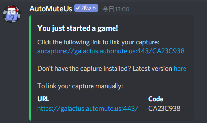

# How to えへへっ鯖 Among Us Bot 
## 必須
ホスト1名
- Steam Among Us
- [Among Us capture (Windowsソフト) ](https://github.com/denverquane/amonguscapture/releases/latest)
- どちらかのBotへのコマンド送信，管理
  - AutoMuteUs 
  - Ehemong_Us
 
## How to AutoMuteUs
1. Among Us capture起動
2. `.au new` `.au n`のどちらかのコマンドを任意のテキストチャンネルへ送信
3. AutoMuteUsからDMでメッセージが送信される
 

4. aaa
