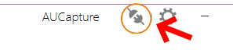
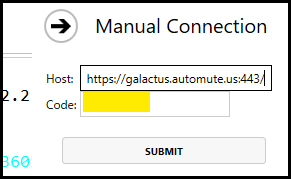
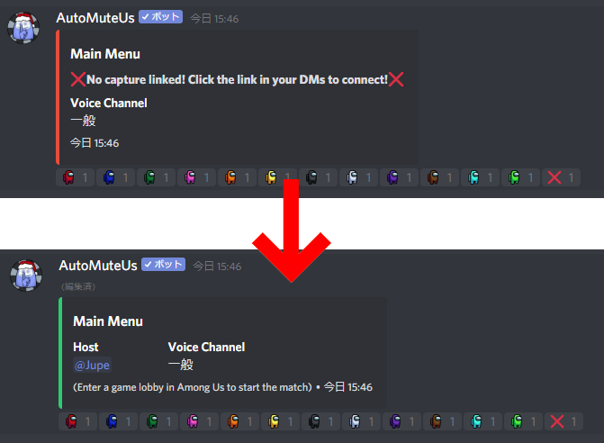

# How to えへへっ鯖 Among Us Bot 
## 必須
ホスト1名
- Steam Among Us
- [Among Us capture (Windowsソフト) ](https://github.com/denverquane/amonguscapture/releases/latest)
- どちらかのBotへのコマンド送信，管理
  - AutoMuteUs 
  - Ehemong_Us
 
## How to AutoMuteUs
1. Among Us capture起動
2. `.au new` `.au n`のどちらかのコマンドを任意のテキストチャンネルへ送信
3. AutoMuteUsからDMでメッセージが送信される  

4. a.) **Click the following link to link your capture:** をクリック  
b.) メッセージ下部の **URL, Code** を手動で AmongUsCapture へ入力  
  
  

5. テキストチャンネル内のAutoMuteUs Botの表示がグリーンになれば準備完了
  
6. 各プレイヤーが Discord 上で，**自分の色と同じリアクションの絵文字**をクリック
